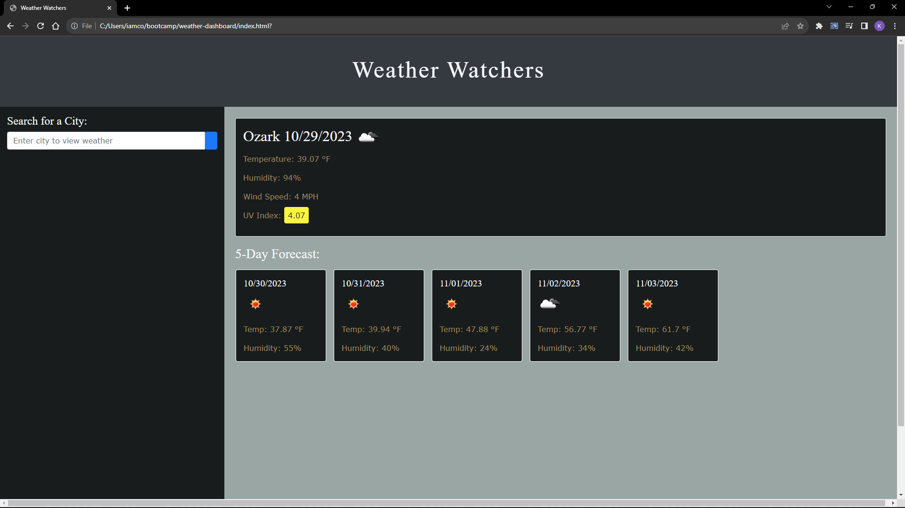

# Weather-Watcher

## URL : 

## Discription:

Alrighty this project really wasnt that hard due to what we were doing this week and having a full week to prep. But this application is to look up weather for any city and it will show it. Just like a normal weather dashboard would typically. I was getting stuck on getting the weather api to run properly but after several hours of tries we got this to work properly. I used the css box styling for this it's pretty basic but it gets the job done. 

## Acceptance Criteria:

GIVEN a weather dashboard with form inputs
WHEN I search for a city
THEN I am presented with current and future conditions for that city and that city is added to the search history
WHEN I view current weather conditions for that city
THEN I am presented with the city name, the date, an icon representation of weather conditions, the temperature, the humidity, and the wind speed
WHEN I view future weather conditions for that city
THEN I am presented with a 5-day forecast that displays the date, an icon representation of weather conditions, the temperature, the wind speed, and the humidity
WHEN I click on a city in the search history
THEN I am again presented with current and future conditions for that city

## Screen Shot: 

## Sources:

https://getbootstrap.com/

https://openweathermap.org/

https://www.w3schools.com/css/css_boxmodel.asp

